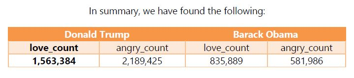
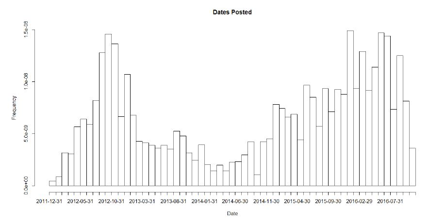
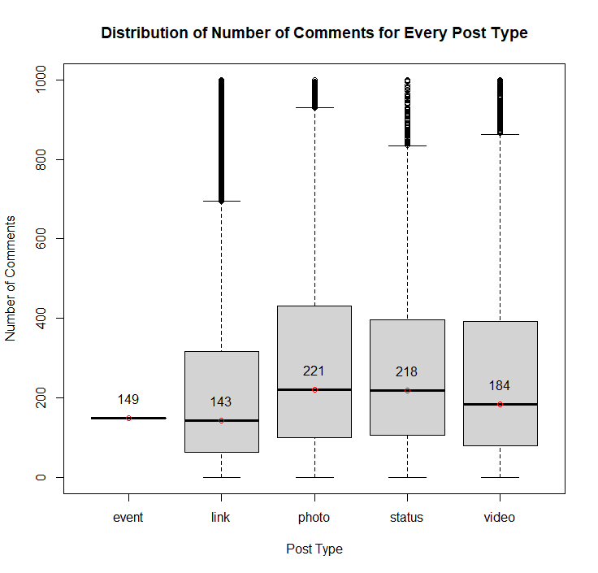

Mainstream Media Analysis
=====

## Table of contents
* [About](#about-the-project)
* [Dataset](#dataset)
* [Results](#results)
* [Technologies Used](#technologies-used)

## About the project
Big data processing and analaysis of mainstream media posts from 15 top sources (BBC, CNN, Fox News) extracted from Facebook (2012-2016) with a focus on scrutinizing user reactions (like, love, care, wow, haha, sad, angry) to media posts relating to past presidents and at-the-time presidential candidates of the United States using shell scripting, then examine the frequency of user reactions to these posts over time in R.

Visualization and analysis of user engagement on different types of facebook posts (links, photos, status updates, videos, etc.) from ABC news using R.

## Dataset
The dataset used for this project was extracted from public Facebook posts of some of the top mainstream media sources and consists of ~534,000 posts ranging from 2012 to 2016. Metadata available for each post includes:
* post id
* message
* description
* caption
* post type
* reactions (love count, wow count, haha count, sad count, thankful count, angry count)
* user interaction (comments, shares)
* date/time posted

## Model
I experimented with models of various complexity and found that I achieved the best results (most generalize-able classifier) with one of the simplest models. Its architecture is as follows:
* A single convolutional layer
* A single max pooling layer
* Two dense layers

## Results
### Comparing love and angry reactions for posts mentioning Donald Trump to those mentioning Barack Obama

Insights: Although Trump seems to elicit more positive reactions compared to Obama, he also incites more anger and hate. This is a reflection of the divisive nature of Trump's at-the-time candidacy and eventual presidency, i.e. the majority of people have a strong opinion in regards to Trump. The fact that he has 40% more angry reactions than love reactions suggests that a larger userbase have a negative opinion of Trump (at least the people who interact with and follow major news sources on FB). 

On the other hand, Obama is nowhere near as divisive a figure as Trump, i.e. a sizeable number of people have a neutral or even no opinion of him. Unlike Trump, he has 40% more love reactions than  hate reactions suggesting that a larger userbase have a positive opinion of Obama (at least the people who interact with and follow major news sources on FB).
### Frequency of posts mentioning Obama over time (2012-2016)

### User engagement comparison for different types of posts

## Technologies used
* shell scripting (using Cygwin)
* R
